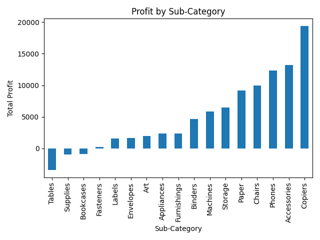
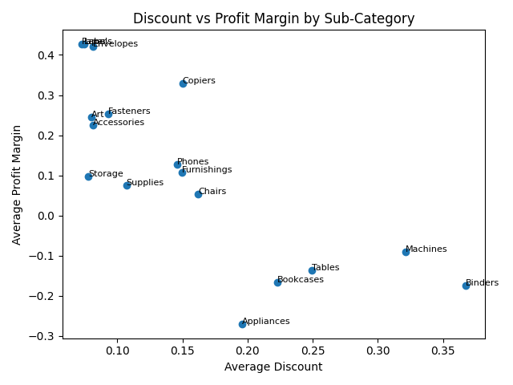

# Superstore Sales Analysis (Python Project)

## Objective

Analyze sales performance to understand how revenue, profit, and discounting interact across product sub-categories.

The goal is to identify which categories drive profit and which destroy value despite high sales.

---

## Dataset

Retail transaction data including:

- Sales
- Profit
- Discount
- Sub-Category

---

## Tools Used

- Python
- pandas (data analysis)
- matplotlib (visualization)

---

## Key Insights

### 1. High Sales ≠ High Profit

Some sub-categories generate strong sales but negative profitability due to cost structure and discounting.

### 2. Discounting reduces profitability

Higher average discounts are generally associated with lower profit margins.

### 3. Clear profit drivers exist

Certain categories consistently generate strong margins and should be prioritized for growth.

---

## Visual Analysis

### Profit by Sub-Category

Shows which categories generate profit vs loss.

---

### Discount vs Profit Margin()

Shows relationship between discounting and profitability efficiency.

---

## Business Recommendation

- Reduce aggressive discounting in loss-making categories
- Focus on high-margin categories instead of high-sales categories
- Re-evaluate pricing strategy for structurally unprofitable segments

---

## Conclusion

This analysis demonstrates that revenue growth alone is not a sufficient performance metric. Profitability and discount efficiency must be considered together for sustainable business decisions.
