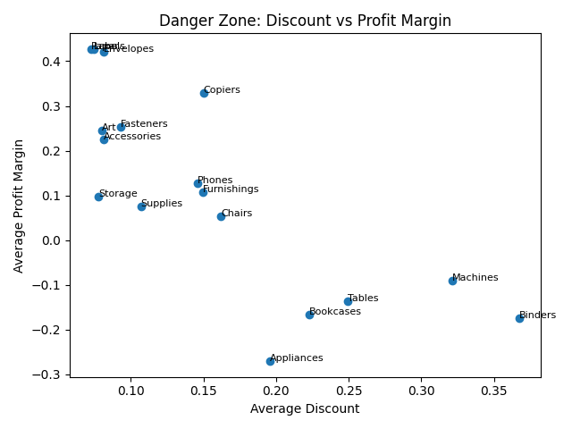
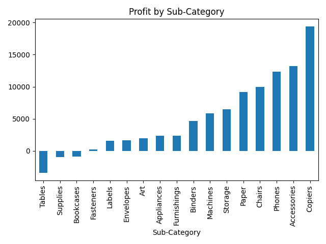

# 📊 Superstore Sales Analysis – Profitability & Discount Risk Study

## 🎯 Executive Summary

This analysis explores profitability patterns in a retail “Superstore” dataset with a focus on discount impact, sub-category performance, and margin efficiency.

Key findings:

- Profitability is highly concentrated in a small number of sub-categories
- High discount levels are strongly correlated with lower or negative profit margins
- Certain high-cost product groups remain profitable due to controlled discounting

The analysis highlights structural inefficiencies in pricing and discount strategy.

---

## 🧠 Key Insights

- **Discount sensitivity is the strongest driver of margin erosion**
- Sub-categories such as _Tables, Bookcases, and Supplies_ show consistent underperformance
- High-value categories (e.g. Copiers) remain profitable due to low discount exposure despite high unit cost
- Profit distribution is highly skewed, indicating dependency on a limited set of categories

---

## 📊 Visual Evidence

### Danger Zone: Discount vs Profit Margin

This chart shows the relationship between discount intensity and profitability across sub-categories.

Higher discount levels consistently align with reduced or negative profit margins, indicating that discounting is not being used in a controlled or value-driven way across all product groups.

---

### 📊 Profit Distribution by Sub-Category

This chart highlights the distribution of total profit across sub-categories.

A small number of sub-categories generate the majority of profit, while several categories operate at low or negative returns.

---

## 📈 Category-Level Performance Summary

| Sub-Category |  Sales |   Profit | Discount | Margin Assessment |
| ------------ | -----: | -------: | -------: | ----------------- |
| Copiers      |   High |     High |      Low | Highly Efficient  |
| Tables       | Medium | Negative |     High | Risk Zone         |
| Bookcases    | Medium |      Low |     High | Weak Efficiency   |
| Supplies     |    Low | Negative |   Medium | Inefficient       |

---

## ⚠️ Risk Zones Identified

- High discount + low margin categories:
  - Tables
  - Bookcases
  - Supplies

These categories show structural profitability issues and should be reviewed for pricing and discount strategy.

---

## 💡 Business Implications

- Discounting is being applied too aggressively in low-margin categories
- Profit concentration increases business risk exposure
- Pricing strategy is not uniformly aligned with cost structure
- Optimisation potential exists in discount governance and category segmentation

---

## 🛠️ Tools Used

- Python (Pandas, Matplotlib, Seaborn)
- Jupyter / Script-based analysis
- Basic statistical aggregation and segmentation

---

## 📁 Project Structure
